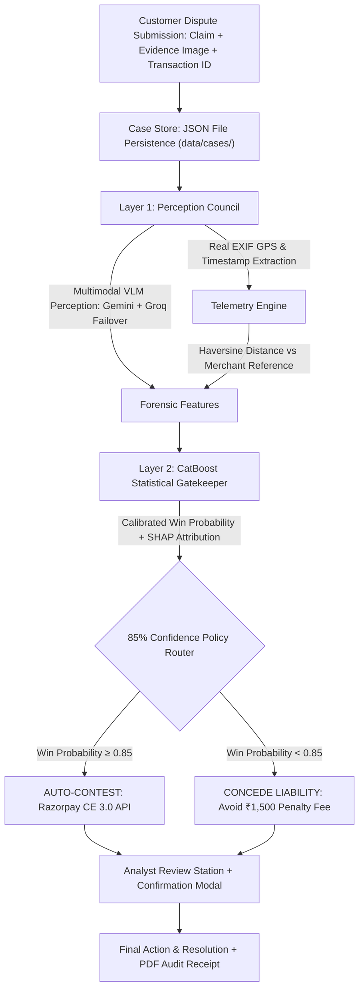

<div align="center">

# REBUTTAL

### Automated Defense, Backed by Proof — Not Persuasion


*Autonomous Multimodal Dispute Forensics & Razorpay CE 3.0 Automation*

[](https://www.python.org/)
[](https://fastapi.tiangolo.com/)
[](https://catboost.ai/)
[](https://ai.google.dev/)
[](https://www.langchain.com/langgraph)
[](https://razorpay.com/)
[](#license)

</div>

---

> **"Rebuttal doesn't talk your customer out of a dispute. It proves them wrong."**
>
> Rebuttal gates every chargeback contestation behind multimodal visual forensics, real EXIF/GPS telemetry validation against merchant delivery logs, and a calibrated CatBoost statistical gate — protecting merchant margins from non-refundable dispute-loss penalty fees without a single user-facing persuasion tactic.

---

## Table of Contents

- [The Problem](#the-problem)
- [The Solution](#the-solution)
- [System Architecture](#system-architecture)
- [Two-Role Platform Architecture](#two-role-platform-architecture)
- [Forensic & Telemetry Honesty](#forensic--telemetry-honesty)
- [Quantitative 0.85 Threshold Justification](#quantitative-justification-for-the-085-auto-contest-threshold)
- [Tech Stack](#tech-stack)
- [Quickstart & Setup](#quickstart--setup)
- [Key API Endpoints](#key-api-endpoints)
- [Project Structure](#project-structure)
- [Limitations & Disclosures](#limitations--disclosures)

---

## The Problem

Friendly fraud — customers falsely claiming an item was never received, or arrived damaged — costs merchants billions annually. Under card network rules (Visa Compelling Evidence 3.0, Mastercard), contesting a chargeback carries **asymmetric financial risk**:

| Outcome | Financial Impact |
|---|---|
| **Win the dispute** | Recovers transaction capital (₹15,000 – ₹1,20,000+) |
| **Lose the dispute** | Loses transaction amount **+ a non-refundable dispute penalty fee (₹1,500/case)** |

Most approaches either build user-facing chatbots that try to talk customers out of disputes (a major compliance violation) or rely on a single LLM to guess fraud, which hallucinates and cannot be trusted with financial APIs.

**Rebuttal takes an evidence-first, back-office approach.** It is an enterprise dispute operations platform that acts strictly on verifiable data and calibrated statistical confidence.

---

## The Solution

1. **Multimodal Perception Council**: Cross-references customer claim statements against uploaded photos via **Google Gemini** (e.g., `gemini-3.5-flash-lite`, `gemini-3.6-flash`) with automated **Groq Vision Failover** (e.g., `qwen/qwen3.6-27b`) to detect visual contradictions, and extracts real camera EXIF metadata (capture timestamp, GPS coordinates, camera model).
2. **Telemetry Correlation**: Compares evidence coordinates and capture time against authoritative merchant logistics records (`merchant_refs.json`) to detect geofence/temporal mismatches.
3. **Statistical Gatekeeper**: Gates automated actions behind a calibrated `CatBoostClassifier` (held-out synthetic benchmark ROC-AUC `0.9433`, Brier Score `0.0641`) with SHAP TreeExplainer feature attributions.
4. **Dynamic Operational Resolution**:
   - **Win Probability ≥ 85% (`AUTO_CONTEST`)**: Compiles rigid Visa CE 3.0 evidence arrays and transmits to Razorpay Disputes API (`PATCH /v1/disputes/{id}/contest`).
   - **Win Probability < 85% (`CONCEDE LIABILITY`)**: Formally records liability acceptance to protect merchant capital from the non-refundable ₹1,500 card network penalty fee.
5. **Analyst Decision Station with Confirmation Modal**: Human-in-the-loop review station with a formal audit modal before committing determinations to the case ledger.
6. **Forensically Honest PDF Audit Receipt**: Generates downloadable, court-ready PDF audit reports on demand via `ReportLab` directly from backend case records.

---

## System Architecture



---

## Two-Role Platform Architecture

### 1. Risk Operations Console (`/admin` or `/`)
- **Dispute Queue**: Central operations hub displaying all active cases, status filters (New, Evidence Received, Awaiting Review, Submitted, Conceded), and real-time cross-tab sync.
- **5-Stage Defense Workflow**:
  - `01 Intake`: Transaction data, dispute claims, customer KYC profile, and customer evidence responses.
  - `02 Evidence Analysis`: Dual-viewport pixel examination, VLM contradiction detection, and EXIF/GPS telemetry validation.
  - `03 Risk Assessment`: Calibrated win probability gauge, 0.85 policy threshold margin, and human-readable SHAP drivers.
  - `04 Analyst Review`: Recommendation review (`Approve (Auto-Contest)`, `Approve (Concede Liability)`, `Override Strategy`, or `Request Additional Evidence`) with **Decision Confirmation Modal**.
  - `05 Final Action & Resolution`: Dynamic display for CE 3.0 submission vs Liability Acceptance, live API transmission, and PDF Audit Receipt download.

### 2. Customer Dispute Portal (`/customer`)
- **Strict Role Isolation**: Completely separated from admin routes and controls.
- **My Disputes**: Cardholders view submitted disputes, active status badges, and action-required banners.
- **Submit Dispute**: Intake form with real-time transaction ID validation, amount, reason code, claim narrative, and evidence image upload.
- **Additional Evidence Response**: Direct interface for customers to fulfill evidence requests issued by risk operations.

---

## Forensic & Telemetry Honesty

Rebuttal enforces strict truth-in-evidence standards across vision and telemetry:
- **Explicit Visual Analysis States**:
  - `ANALYZED`: Returned only when a model successfully processes image pixels to determine whether the evidence supports or contradicts the dispute claim.
  - `ANALYSIS_FAILED`: Returned when cloud VLM APIs fail or exhaust quota limits; transparently rendered as `"Visual Analysis Unavailable"` with the underlying operational error, and never deceptively converted into "blurry/inconclusive image".
  - `INCONCLUSIVE`: Reserved strictly for when a model actively inspects pixels and determines image clarity/resolution is genuinely insufficient.
- **CE 3.0 Evidentiary Checklist Semantics**: When submitted photographic evidence corroborates the customer's stated damage (no visual contradiction detected), the defense criterion is truthfully labeled `NOT SATISFIED` (merchant defense signal absent) rather than deceptively marking the AI system as "FAILED".
- **No Fabricated Telemetry**: If an image lacks EXIF data (common in chat apps or screenshots), it is explicitly marked `Unavailable / Stripped`.
- **GPS Honesty**: If EXIF exists without GPS tags, coordinates are flagged `Unavailable` and delivery correlation is marked `NOT VERIFIABLE`.
- **Telemetry Verification**: Delivery `MATCH` is asserted **only** when real coordinate data exists in both the image EXIF and merchant logistics delivery records, and falls within acceptable distance/time tolerance limits. If merchant records are missing, the system explicitly reports:
  > *"Merchant delivery telemetry unavailable — correlation not verifiable."*

---

## Quantitative Justification for the 0.85 Auto-Contest Threshold

The 0.85 threshold is mathematically derived from the asymmetric cost matrix:

$$\text{Net Recovery} = (TP \times V_{tx}) - (FP \times (V_{tx} + C_{fee})) - ((FN + TN) \times C_{triage})$$

where $C_{fee} = \text{₹1,500}$ (network dispute-loss penalty) and $C_{triage} = \text{₹200}$ (analyst triage overhead).

| Threshold | Auto-Contest Volume | Precision (Win Rate) | False Positives | Net Financial Impact | Status |
|:---:|:---:|:---:|:---:|:---:|:---:|
| 0.50 | 903 | 65.7% | 310 | ₹29,60,600 | High penalty exposure |
| 0.70 | 808 | 72.3% | 224 | ₹42,25,600 | High penalty exposure |
| **0.85** | **762** | **73.9%** | **199** | **₹43,13,900** | ⭐ **Optimal Recovery** |
| 0.90 | 357 | 97.5% | 9 | ₹41,42,900 | Overly conservative |

---

## Tech Stack

| Component | Technologies |
|---|---|
| **Backend** | FastAPI, Uvicorn, Pydantic, Python 3.10+ |
| **ML & Explainability** | CatBoostClassifier, SHAP (TreeExplainer), Scikit-Learn |
| **Multimodal Vision** | Google Gemini (`gemini-3.5-flash-lite`, `gemini-3.6-flash`), Groq Vision (`qwen/qwen3.6-27b`), Pillow (In-Memory Downsampling) |
| **Forensics** | ExifRead, Haversine Coordinate Distance Math |
| **Audit Generation** | ReportLab 5.x (In-memory PDF generation) |
| **Agent Orchestration** | LangGraph, Razorpay Python SDK |
| **Persistence** | File-backed atomic JSON Case Store (`data/cases/`) |
| **Frontend** | Vanilla JS, CSS Custom Properties, FinTech Operations Design System |

---

## Quickstart & Setup

### 1. Clone & Install Dependencies

```bash
git clone https://github.com/chethanataltaje/multimodal-chargeback-defender.git
cd multimodal-chargeback-defender
python -m venv .venv
source .venv/bin/activate  # On Windows: .venv\Scripts\activate
python -m pip install -r requirements.txt
```

### 2. Configure Environment

Copy the example template and add your API keys:

```bash
cp .env.example .env  # On Windows PowerShell: Copy-Item .env.example .env
```

```ini
# Required for primary VLM perception
GEMINI_API_KEY=your_gemini_api_key
GEMINI_MODEL=gemini-3.5-flash-lite  # Or gemini-3.6-flash

# Optional: Groq Vision Fallback
GROQ_API_KEY=your_groq_api_key
GROQ_VISION_MODEL=qwen/qwen3.6-27b

# Optional: Razorpay Credentials (Leave blank for Demo Simulation Mode)
# RAZORPAY_KEY_ID=rzp_test_your_key_id
# RAZORPAY_KEY_SECRET=your_key_secret
```

### 3. Verify All Test Suites

Run the 8 automated Buildathon verification suites:

```bash
python verify_rebuttal.py
```

### 4. Start the Server

```bash
uvicorn server:app --reload --host 127.0.0.1 --port 8000
```

- **Portal Landing**: [http://127.0.0.1:8000/](http://127.0.0.1:8000/)
- **Admin Risk Console**: [http://127.0.0.1:8000/admin](http://127.0.0.1:8000/admin) *(Demo login: `admin@razorpay.com` / `admin123`)*
- **Customer Portal**: [http://127.0.0.1:8000/customer](http://127.0.0.1:8000/customer) *(Demo login: any email/password)*

---

## Key API Endpoints

| Method | Endpoint | Description |
|---|---|---|
| `GET` | `/api/disputes` | List all disputes in the operations queue |
| `GET` | `/api/disputes/{id}` | Fetch authoritative dispute record |
| `POST` | `/api/disputes` | Customer submits new dispute with evidence image |
| `POST` | `/api/disputes/{id}/analyze` | Run VLM + EXIF + CatBoost defense pipeline |
| `POST` | `/api/disputes/{id}/review` | Persist analyst determination to audit trail |
| `POST` | `/api/disputes/{id}/submit` | Execute Razorpay CE 3.0 submission or Liability Concession |
| `GET` | `/api/disputes/{id}/audit-receipt` | Stream Court-Ready PDF Audit Receipt (ReportLab) |
| `GET` | `/api/vlm-config` | Dynamic VLM primary and fallback model configuration |
| `GET` | `/api/razorpay-status` | Connectivity mode: Simulation vs Testnet vs Live API |
| `GET` | `/api/model-evaluation` | Authoritative held-out test evaluation artifact |
| `GET` | `/api/cost-matrix` | Validation-derived financial recovery curve & threshold metrics |
| `POST` | `/api/customer/disputes/{id}/respond-info` | Customer submits requested supplemental evidence |

---

## Project Structure

```
multimodal-chargeback-defender/
├── server.py                       # FastAPI application & REST/PDF endpoints
├── main.py                         # CLI multi-scenario runner
├── requirements.txt                # Full Python dependencies
├── src/
│   ├── case_store.py               # Authoritative JSON case store & audit trail
│   ├── orchestrator/
│   │   ├── agent.py                # LangGraph defense workflow orchestrator
│   │   └── razorpay_client.py      # Razorpay SDK CE 3.0 client & sandbox
│   ├── perception/
│   │   ├── vlm_analyzer.py         # Google Gemini multimodal contradiction analyzer
│   │   └── metadata_extractor.py   # EXIF GPS/timestamp extraction engine
│   ├── gatekeeper/
│   │   ├── predictor.py            # CatBoost win probability & SHAP explainer
│   │   ├── train_model.py          # Model training pipeline
│   │   └── gatekeeper_model.cbm    # Serialized CatBoost binary model
│   └── schemas/
│       └── data_models.py          # Pydantic data schemas & state models
├── frontend/
│   ├── index.html                  # Risk Operations Console SPA
│   ├── app.js                      # Admin controller & multi-stage state engine
│   ├── style.css                   # Enterprise design tokens & layouts
│   ├── landing.html                # Role selection portal
│   └── customer/
│       ├── index.html              # Customer Dispute Portal SPA
│       └── app.js                  # Customer intake & dispute tracking logic
└── data/
    ├── merchant_refs.json          # Merchant logistics & delivery telemetry references
    ├── test_samples/               # Illustrative test evidence imagery
    └── cases/                      # Authoritative dispute JSON storage records
```

---

## Model Evaluation & Held-Out Test Methodology

To ensure scientific honesty and reproducibility for **Razorpay Buildathon Track 02 (AI Risk Manager)**, the statistical gatekeeper is evaluated using a strictly **quarantined held-out synthetic test set** (5,000 samples) that was never touched during model fitting, hyperparameter tuning, calibration, or threshold selection.

> [!NOTE]
> **Synthetic Benchmark Disclosure**:
> Under RBI privacy regulations and payment scheme guidelines, proprietary cardholder logs and raw banking records cannot be published. The model is trained and validated on a mathematically modeled 25,000-sample synthetic dataset. **All quantitative metrics below represent offline held-out synthetic benchmark evaluations and must not be interpreted as live production performance statistics.**

### 1. Dataset & Partitioning
- **Dataset**: `data/synthetic_chargeback_data.csv` (25,000 synthetic samples). *Banking Disclosure: Real merchant dispute records and cardholder transaction logs are strictly confidential under RBI privacy regulations. We mathematically simulated 25,000 records modeling realistic fraud vectors, account tenure distributions, and multimodal perception signals.*
- **Held-Out Split**: 80% Train (20,000 rows) / 20% Held-Out Test (5,000 rows) using stratified sampling (`stratify=y`) with fixed seed (`random_state=42`).
- **Internal Validation**: An 80/20 split inside the 20,000 training portion (16,000 fit / 4,000 val) was used for CatBoost iteration monitoring and threshold sensitivity curves.
- **Zero Leakage**: 0 transaction IDs overlap between train and test sets (`data/held_out_test_ids.json`).

### 2. Held-Out Evaluation Metrics (Synthetic Benchmark @ 85.0% Threshold)
Evaluated on the 5,000 quarantined synthetic test samples:

| Metric | Synthetic Benchmark Value | Context / Interpretation |
|---|---|---|
| **ROC-AUC Score** | **0.9433** | Discriminative ranking capability across simulated fraud vectors |
| **Brier Score Loss** | **0.0641** | Calibration quality (<0.10 indicates well-calibrated probabilities) |
| **Precision (Win Rate @ 85%)** | **71.16%** | Realized win rate when contesting disputes flagged by policy |
| **Recall (@ 85% Threshold)** | **83.02%** | Proportion of legitimately winnable merchant disputes contested |
| **Overall Accuracy** | **93.56%** | Correct classifications across contest and concede determinations |
| **Held-Out Test Samples** | **5,000** | 636 Positive (Historical Wins) / 4,364 Negative (Losses) |

### 3. Confusion Matrix & Asymmetric Cost Breakdown
At the operational business threshold of **85.0%**:

```
                 Predicted Win (>=85%)    Predicted Concede (<85%)
Actual Win (1)          528 (TP)                   108 (FN)
Actual Loss (0)         214 (FP)                  4150 (TN)
```

- **Unsuccessful Contest Penalty**: Card networks levy a non-refundable dispute fee of **₹1,500 per lost case**.
- **Held-Out False-Positive Cost**: `214 FPs × ₹1,500 = ₹3,21,000.00`.
- **Threshold Justification**: Contesting below 85% causes false positive penalty fees to outpace recovered capital. The 85% boundary strictly maximizes net recovered funds after accounting for both transaction loss and the ₹1,500 fee.

### 4. Reproducing the Evaluation
The complete training and held-out evaluation pipeline can be run deterministically:
```bash
python src/gatekeeper/train_model.py
```
Output results are written directly to `data/model_evaluation.json`.

---

## Razorpay Disputes API Integration & Operating Modes

The system interfaces with Razorpay's Dispute Management system using the official Razorpay Python SDK (`client.dispute.contest`). To ensure complete transparency during evaluation and live judging, the system enforces **three explicit operating modes**:

| Mode | Trigger Condition | Status Code / Badge | Description |
|---|---|---|---|
| **`DEMO SIMULATION — NOT SENT TO RAZORPAY`** | Default when no API keys are present | `DEMO_SIMULATION_COMPLETED` (`sim_*` ID) | Validates CE 3.0 schemas and compiles evidence payload locally without making external network calls. Never returns fake success. |
| **`RAZORPAY TEST API`** | `RAZORPAY_KEY_ID=rzp_test_*` configured | `SUBMITTED_VIA_RAZORPAY_TEST_API` | Transmits contestation to Razorpay's sandbox/test environment via official SDK (`PATCH /v1/disputes/{id}/contest`). |
| **`RAZORPAY LIVE API`** | `RAZORPAY_KEY_ID=rzp_live_*` configured | `SUBMITTED_VIA_RAZORPAY_LIVE_API` | Transmits binding dispute defense to Razorpay Production via official SDK (`PATCH /v1/disputes/{id}/contest`). |

### Document ID Integrity Rule
Under Visa CE 3.0 / Razorpay dispute specifications:
- `shipping_proof`, `billing_proof`, and `customer_communication` strictly contain **uploaded Document IDs** (`doc_xxxx`).
- Internal EXIF metadata and VLM reasoning are synthesized into the **`summary` defense narrative**, and are **never** injected as fake document IDs.

---

## Limitations & Disclosures

- **Synthetic Baseline Distribution & Benchmark Nature**: The CatBoost model is trained on a synthetic dataset of 25,000 mathematically correlated dispute transactions due to the strict confidentiality of proprietary cardholder and merchant banking data. All reported metrics reflect this synthetic benchmark distribution and are presented strictly as experimental validation results rather than live production operational performance.
- **EXIF Stripping by Social Platforms**: Images uploaded through social channels (WhatsApp, screenshots) frequently lack EXIF metadata. The system flags this explicitly as an unverified signal rather than assuming tampering.
- **Defense-Only Scope**: The system never communicates unprompted messages or applies persuasive pressure to the cardholder; it operates strictly as an internal decision engine and API integration layer.

---
