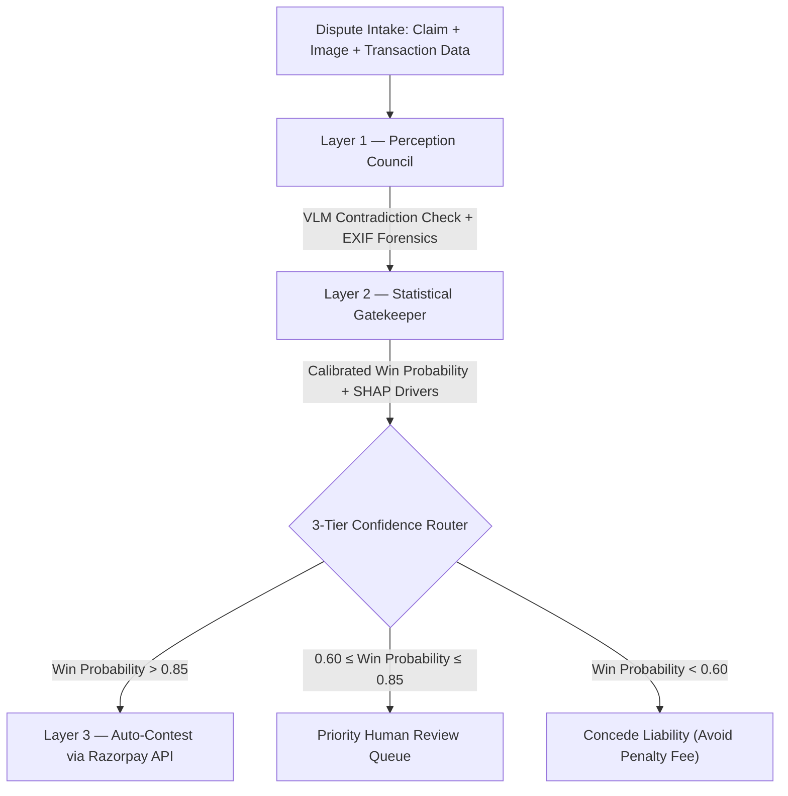

<div align="center">

# REBUTTAL

### Automated Defense, Backed by Proof — Not Persuasion

**Razorpay Buildathon 2026 · Track 02: AI Risk Manager**

*Autonomous Multimodal Dispute Forensics & Razorpay CE 3.0 Automation*

[](https://www.python.org/)
[](https://www.langchain.com/langgraph)
[](https://catboost.ai/)
[](https://fastapi.tiangolo.com/)
[](#license)

</div>

---

> **"Rebuttal doesn't talk your customer out of a dispute. It proves them wrong."**
>
> Rebuttal gates every chargeback contestation behind multimodal vision forensics, EXIF camera telemetry, and a calibrated CatBoost statistical gate — protecting merchant margins from non-refundable dispute-loss penalty fees without a single user-facing persuasion tactic.

---

## Table of Contents

- [The Problem](#the-problem)
- [The Solution](#the-solution)
- [System Architecture](#system-architecture)
- [Threshold Justification](#quantitative-justification-for-the-085-auto-contest-threshold)
- [Tech Stack](#tech-stack)
- [Quickstart](#quickstart--launch)
- [Project Structure](#project-structure)
- [Limitations & Disclosures](#limitations--disclosures)
- [Roadmap](#roadmap)

---

## The Problem

Friendly fraud — customers falsely claiming an item was never received, or arrived damaged — costs merchants billions annually. Under card network rules (Visa Compelling Evidence 3.0, Mastercard), contesting a chargeback carries **asymmetric financial risk**:

| Outcome | Financial Impact |
|---|---|
| **Win the dispute** | Recovers transaction capital (₹15,000 – ₹1,20,000+) |
| **Lose the dispute** | Loses transaction amount **+ a non-refundable dispute-loss penalty fee (≈₹1,500/case)** |

Most hackathon and even commercial approaches to this problem either (a) build user-facing chatbots that try to talk customers out of disputes — a compliance risk — or (b) use a single LLM to guess fraud likelihood, which hallucinates and cannot be trusted to fire financial API calls unsupervised.

**Rebuttal takes neither approach.** It is a defense-only, back-office risk engine that never talks to the customer — it only acts on evidence, and only when statistically confident.

---

## The Solution

Rebuttal is an autonomous system that:

1. **Cross-references** customer claims against photographic evidence and EXIF telemetry via a dual-tier vision-language model council (**Google Gemini 3.6 Flash / 2.5 Flash** + Groq Vision).
2. **Gates** every automated action behind a calibrated CatBoost probability classifier (ROC-AUC `0.9529`, Brier Score `0.0579`) — nothing fires on a guess.
3. **Formats** CE 3.0–compliant evidence arrays and auto-contests eligible disputes via the **official Razorpay Python SDK & Disputes API (`POST /v1/disputes/{id}/contest`)**, while routing uncertain cases to a human analyst with full SHAP explainability.

---

## System Architecture



### Layer 1 — Perception Council (Agentic Multimodal Forensics)

| Component | Role |
|---|---|
| **Primary VLM** | Google Gemini 3.6 Flash / 2.5 Flash — flags physical contradictions between claim text and evidence image |
| **Failover VLM** | Groq Cloud Vision, invoked automatically on primary quota/timeout |
| **Image Forensics** | Deterministic EXIF extraction (GPS + capture timestamp) against delivery logs, with an explicit fallback flag for EXIF-stripped screenshots |
| **Output Schema** | Strictly typed Pydantic `VisionAssessment` — `vlm_contradiction_found`, `vision_confidence_score`, `insufficient_evidence`, `rationale` |

### Layer 2 — Statistical Gatekeeper (CatBoost ML Engine)

- **Model**: `CatBoostClassifier`, using native ordered target statistics for categorical features (dispute reason codes, merchant categories, etc.) — no brittle one-hot encoding pipelines.
- **Explainability**: `shap.TreeExplainer` computes per-dispute feature attribution for the human review dashboard.
- **Calibration**: Validated against held-out data — Brier Score `0.0579`, ROC-AUC `0.9529`.

### Layer 3 — Orchestrator & Platform Integration

State machine built on **LangGraph**, with a strict 3-tier confidence split:

- **`> 0.85` → Auto-Contest**: Synthesizes a CE 3.0 evidence payload and fires the contest request via the official Razorpay SDK.
- **`0.60 – 0.85` → Priority Review**: Routed to the analyst triage queue with SHAP-backed reasoning.
- **`< 0.60` → Concede**: Recommends accepting liability to avoid a larger penalty-fee loss.

---

## Quantitative Justification for the 0.85 Auto-Contest Threshold

The threshold was derived from an asymmetric financial cost model rather than chosen arbitrarily:

$$\text{Net Recovery} = (TP \times V_{tx}) - (FP \times (V_{tx} + C_{fee})) - ((FN + TN) \times C_{triage})$$

where `C_fee = ₹1,500` (dispute-loss penalty) and `C_triage = ₹200` (analyst review cost).

| Threshold | Auto-Contest Volume | Precision (Win Rate) | False Positives | Net Financial Impact | Status |
|:---:|:---:|:---:|:---:|:---:|:---:|
| 0.50 | 903 | 65.7% | 310 | ₹29,60,600 | High penalty exposure |
| 0.70 | 808 | 72.3% | 224 | ₹42,25,600 | High penalty exposure |
| **0.85** | **762** | **73.9%** | **199** | **₹43,13,900** | ⭐ **Optimal** |
| 0.90 | 357 | 97.5% | 9 | ₹41,42,900 | Conservative |

> Threshold `0.85` maximizes net recovered capital while suppressing dispute-loss penalty exposure — the tradeoff a merchant risk team would actually optimize for.

---

## Tech Stack

| Category | Tools |
|---|---|
| **Platform Integration** | `razorpay` (Official Python SDK) |
| **Agent Orchestration** | `langgraph`, `pydantic` |
| **Vision & Language Models** | Google GenAI SDK (`google-genai`), Groq Cloud API (`httpx`) |
| **ML & Forensics** | `catboost`, `shap`, `scikit-learn`, `exifread`, `pillow`, `pandas`, `numpy` |
| **Backend** | `fastapi`, `uvicorn` |
| **Frontend / Dashboard** | Column / Brex FinTech Design System (Vanilla JS, CSS Tokens) |

---

## Quickstart & Launch

### 1. Clone & install dependencies

```bash
git clone <repo-url>
cd multimodal-chargeback-defender
pip install -r requirements.txt
```

### 2. Configure environment

Create a `.env` file at the project root:

```ini
# Required
GEMINI_API_KEY=your_gemini_api_key
GROQ_API_KEY=your_groq_api_key

# Optional — omit to run the Razorpay SDK in sandbox/mock mode
RAZORPAY_KEY_ID=rzp_test_your_key_id
RAZORPAY_KEY_SECRET=your_key_secret
```

### 3. Launch the web console

```bash
python server.py
```

Open **http://127.0.0.1:8000** in your browser.

### 4. Or run the pipeline via CLI

```bash
python main.py
```

---

## Project Structure

```
multimodal-chargeback-defender/
├── server.py                   # FastAPI backend & multipart image upload endpoints
├── main.py                     # CLI pipeline runner (3 demo scenarios)
├── src/
│   ├── perception/             # Layer 1: Gemini 3.6 Flash VLM + EXIF forensics
│   │   ├── vlm_analyzer.py
│   │   └── metadata_extractor.py
│   ├── gatekeeper/             # Layer 2: CatBoost ML engine + SHAP explainability
│   │   ├── predictor.py
│   │   ├── train_model.py
│   │   └── gatekeeper_model.cbm
│   ├── orchestrator/           # Layer 3: LangGraph state machine & Razorpay SDK
│   │   ├── agent.py
│   │   └── razorpay_client.py
│   └── schemas/                # Strictly typed Pydantic data contracts
│       └── data_models.py
├── frontend/                   # Column / Brex FinTech Web Console
│   ├── index.html
│   ├── style.css
│   └── app.js
├── data/                       # Synthetic training dataset & generator
│   ├── generate_synthetic_data.py
│   └── synthetic_chargeback_data.csv
└── requirements.txt
```

---

## Limitations & Disclosures

We believe transparency here matters more than a polished claim:

- **Training data is synthetic.** The CatBoost model is trained on a generated dataset of 25,000 mathematically correlated dispute rows modeling realistic fraud/legitimate distributions — no team has access to real cardholder dispute records for a hackathon.
- **EXIF metadata is often unavailable.** Images shared via WhatsApp, iMessage, or screenshots frequently have GPS/timestamp metadata stripped. The system flags "metadata unavailable" as its own high-risk signal rather than assuming EXIF will always be present.
- **Vision model outputs carry uncertainty.** Ambiguous or low-quality images can produce low-confidence contradiction flags; these are surfaced to the human reviewer rather than silently auto-contested.
- **This is a defense-only system.** It never communicates with, or attempts to persuade, the end customer — all outputs are directed at back-office risk operations and Razorpay CE 3.0 dispute APIs.

---

## Roadmap

- [x] 3-tier confidence router with priority human triage band (0.60 – 0.85)
- [x] Live custom image drag-and-drop & multipart upload pipeline
- [x] SHAP feature-level attribution & unit economics justification
- [ ] Validate the CatBoost model against real anonymized dispute data from merchant partners
- [ ] Add multi-image evidence support (sequential unboxing and delivery photos)
- [ ] Extend SHAP dashboard with cohort-level fraud pattern analysis

---

<div align="center">

Built for **Razorpay Buildathon 2026** · Track 02: AI Risk Manager

</div>
